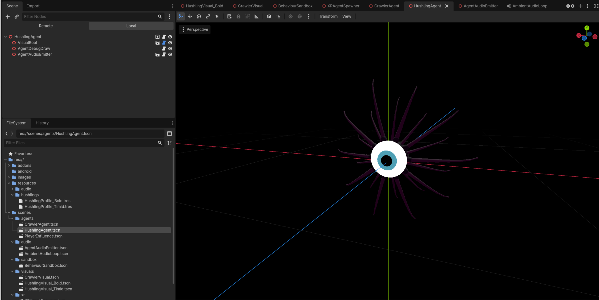
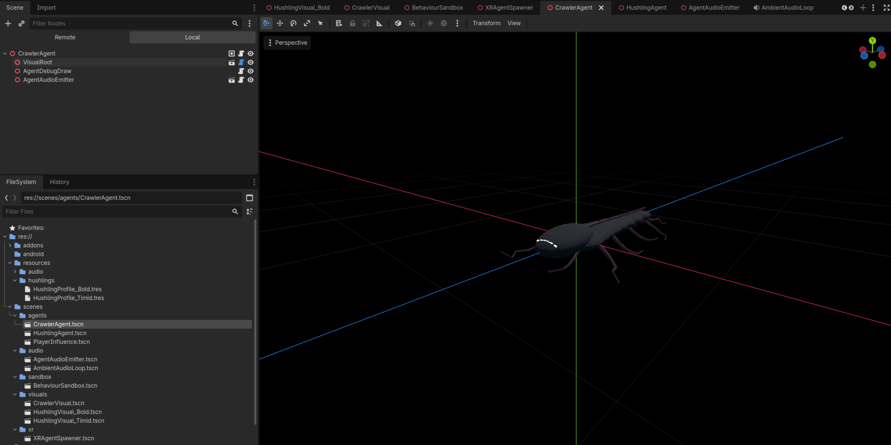

# Hushlings

Name: Noel McCarthy

Student Number: C22533826

Class Group: TU856/Y4

Video: Will record tomorrow before lab.

# Description of the project

Hushlings is a Godot extended reality with passthrough autonomous agents project. It creates a small artificial life ecosystem where Hushlings move around the player's space and react to each other, the player, and a separate Crawler creature.

The Hushlings are social artificial life agents. They wander, regroup, observe, follow, flee, and startle based on local perception and internal variables such as fear, curiosity, confidence, and loneliness. A Hushling on its own is more timid, while Hushlings in a group become more willing to observe and follow.

The Crawler is a separate non-Hushling interest entity. It moves through the same space and gives the Hushlings something to watch, follow, and flee from if it gets too close.

The project is designed for XR passthrough on Meta Quest using OpenXR. It does not currently use a full scanned room mesh for navigation. Obstacle avoidance is handled with proxy obstacles and ray feelers, including player hand obstacle areas.

# Screenshots





# Instructions for use

For XR/passthrough, open:

```text
res://Main.tscn
```

Run this scene with the Godot OpenXR setup on a Meta Quest compatible device. The main scene includes the `XROrigin3D`, `XRCamera3D`, left/right hand tracking nodes, passthrough setup, player influence, ambient audio, and the XR agent spawner.

Useful controls/settings:

- In `Main.tscn`, the `XRAgentSpawner` controls Hushling count, Crawler count, spawn bounds, XR tuning values, and creature scale.
- Hushlings can react to player gaze and player hand proxy obstacles.
- The debug view can show perception ranges, velocity, desired velocity, steering force, obstacle feeler rays, state labels, and target lines. Toggle it on before loading.

# How it works

The movement system is steering based:

```text
force -> acceleration -> velocity -> position
```

`AgentMotor3D.gd` owns the core movement values such as velocity, acceleration, desired velocity, steering force, max speed, max force, and home bounds. Movement is treated as 3D `Vector3` movement so the agents can drift up/down as well as left/right/forward/back in XR space.

The Hushlings use a finite state machine with these states:

- `WANDER`
- `REGROUP`
- `OBSERVE`
- `FOLLOW`
- `FLEE`
- `STARTLED`

The Hushling state machine reads perception and internal variables to decide what the agent should do. For example, a Hushling may observe a Crawler from a safe distance, follow it if the group is confident enough, flee if it gets too close, or regroup after danger has passed.

The steering system includes:

- wander
- seek
- arrive
- flee
- separation
- cohesion
- alignment
- obstacle ray feelers

The boids-style forces are blended into the state movement rather than being a separate state. This means Hushlings can still keep personal space, move with nearby Hushlings, and form loose groups while wandering, observing, following, or fleeing. The Crawler has simpler behaviour. It is an `interest_entity` that idles, wanders, and flees from player hand/proxy threats. It is not another Hushling, so it does not use the same social/emotional system. Player influence is represented using a player node and XR hand proxy obstacles. Hushlings can respond to proximity, gaze, and hand obstacle feelers. A direct gaze at an isolated Hushling can make it startle/freeze and face the player. The creature visuals are passive. They read state, velocity, fear/confidence, and target direction from the agent scripts, but they do not control the actual movement. This kept the behaviour easier to tune before adding more complex visuals. Runtime debug drawing uses DebugDraw3D. This helped make invisible steering and perception logic visible while tuning the project.

# List of classes/assets in the project

| Class/asset                                            | Source                                                                              |
| ------------------------------------------------------ | ----------------------------------------------------------------------------------- |
| `res://Main.tscn`                                      | Self assembled XR/passthrough main scene                                            |
| `res://scenes/sandbox/BehaviourSandbox.tscn`           | Self written desktop behaviour test scene                                           |
| `res://scenes/agents/HushlingAgent.tscn`               | Self written agent scene                                                            |
| `res://scenes/agents/CrawlerAgent.tscn`                | Self written agent scene                                                            |
| `res://scenes/agents/PlayerInfluence.tscn`             | Self written player influence scene                                                 |
| `res://scenes/visuals/HushlingVisual_Timid.tscn`       | Self written procedural visual scene                                                |
| `res://scenes/visuals/HushlingVisual_Bold.tscn`        | Self written procedural visual scene                                                |
| `res://scenes/visuals/CrawlerVisual.tscn`              | Self written procedural visual scene                                                |
| `res://scripts/agents/AgentMotor3D.gd`                 | Self written                                                                        |
| `res://scripts/agents/HushlingAgent.gd`                | Self written                                                                        |
| `res://scripts/agents/CrawlerAgent.gd`                 | Self written                                                                        |
| `res://scripts/agents/PlayerInfluence.gd`              | Self written                                                                        |
| `res://scripts/agents/FleeMemory.gd`                   | Self written                                                                        |
| `res://scripts/agents/IdleCadence.gd`                  | Self written                                                                        |
| `res://scripts/fsm/HushlingStateMachine.gd`            | Self written                                                                        |
| `res://scripts/profiles/HushlingProfile.gd`            | Self written                                                                        |
| `res://resources/hushlings/HushlingProfile_Timid.tres` | Self written tuning resource                                                        |
| `res://resources/hushlings/HushlingProfile_Bold.tres`  | Self written tuning resource                                                        |
| `res://scripts/steering/Steering.gd`                   | Self written, based on steering behaviour principles from class                     |
| `res://scripts/steering/Boids.gd`                      | Self written, based on boids principles from class                                  |
| `res://scripts/steering/ObstacleAvoidance.gd`          | Self written                                                                        |
| `res://scripts/perception/AgentPerception.gd`          | Self written                                                                        |
| `res://scripts/perception/PlayerPerception.gd`         | Self written                                                                        |
| `res://scripts/debug/AgentDebugDraw.gd`                | Self written wrapper using DebugDraw3D                                              |
| `res://scripts/visuals/HushlingVisual.gd`              | Self written                                                                        |
| `res://scripts/visuals/TentacleIKChain.gd`             | Self written procedural/IK visual helper                                            |
| `res://scripts/visuals/CrawlerVisual.gd`               | Self written                                                                        |
| `res://scripts/visuals/CrawlerAppendageIKChain.gd`     | Self written procedural/IK visual helper                                            |
| `res://scripts/audio/AgentAudioEmitter.gd`             | Self written                                                                        |
| `res://scripts/audio/AmbientAudioLoop.gd`              | Self written                                                                        |
| `res://scripts/xr/XRAgentSpawner.gd`                   | Self written                                                                        |
| `res://resources/audio/*.mp3`                          | Project audio files; final external sources should be listed if any were downloaded |
| `res://addons/debug_draw_3d/`                          | External DebugDraw3D addon, MIT licence                                             |
| `res://addons/godot-xr-tools/`                         | External Godot XR Tools addon, MIT licence                                          |
| `res://addons/godotopenxrvendors/`                     | External Godot OpenXR Vendors addon                                                 |

# References

- Godot Engine documentation: https://docs.godotengine.org/
- Godot XR documentation: https://docs.godotengine.org/en/stable/tutorials/xr/
- Godot XR Tools: https://github.com/GodotVR/godot-xr-tools
- Godot OpenXR Vendors plugin: https://github.com/GodotVR/godot_openxr_vendors
- DebugDraw3D addon by Dmitriy Salnikov: https://github.com/DmitriySalnikov/godot_debug_draw_3d
- DebugDraw3D documentation: https://dd3d.dmitriysalnikov.ru/docs/
- Craig Reynolds, Boids: https://www.red3d.com/cwr/boids/
- Craig Reynolds, Steering Behaviors For Autonomous Characters: https://www.red3d.com/cwr/steer/
- Audio assets are from https://pixabay.com/

# What I am most proud of in the assignment

I'm most proud of how the visualisations came together, Boids and emergent behaviour are a favourite of mine so to see visualisations come together with the correct behaviour logic attached driving it was really satisfying. The Hushling entities feel social, really creepy and eerie ! While doing play testing I would often get focused on a few entities to check their behaviour and then turn around and find a group staring at me with their single big eye, which I can't lie was unsettling, but exactly the vibe I wanted, so I'm proud of that. They feel like little stalkers! Another part I am proud of is separating behaviour from visuals. The agent scripts decide state and movement, while the visual scripts only respond to those values. This made it easier to build the autonomous behaviour first and then improve the creature presentation afterwards.

# What I learned

I learned how to implement Boids, Finite state machines, using debugdraw I could learn how the different velocity forces affect movement, and how to tune forces to make it realistic looking. Th steering behaviours become much more interesting when they are layered together. Wander, seek, arrive, flee, separation, cohesion, and alignment are each simple on their own, but combining them with state logic creates more believable agent behaviour. I also learned that boids style forces need careful tuning. If cohesion or alignment is too strong, the agents move too uniformly. If separation is too weak, they overlap. Small values can make a big difference, especially in XR where scale is more noticeable. I learned that behaviour should come before animation. Early prototype visuals made it harder to judge whether the agents were actually autonomous, so rebuilding the project with placeholder behaviour first helped keep the system cleaner, I got a lot of the behaviour coded in with a sandbox scene that i could run on the desktop which meant the project was faster to iterate on too, instead of setting up our main XR scene each time. XR/passthrough also changed how I thought about scale and space. The creatures had to be smaller, slower, and more readable when viewed around the player rather than on a normal monitor.

# Proposal submitted:

My primary changes from the proposal were the visuals of the Hushlings, I proposed evolving shaped creatures that would mimic human stature over time, this was a bit ambitious for the scope and instead I went to keep the uneasy feeling and created the design thats used now. Another change is the circling behaviour, currently instead they will observe the user and with gained confidence get closer/flee less.

# Autonomous Agents Project Proposal

## Hushlings: A Social Artificial Life Swarm

### 1. Project Overview

This project will implement a small population of autonomous artificial creatures called **Hushlings**, designed to behave like a strange/unfamiliar social species with their own emotional states and subsequent emergent group behaviour.

Each creature will operate as an independent agent with internal needs and emotions such as fear, curiosity, confidence, and loneliness. These internal states will influence their behaviour and decision making, allowing the creatures to pursure goals autonomously.

Individually, each Hushling behave timidly and attempt to avoid the player while searching for others of their kind. However, as their local swarm grows, their behaviour changes. Small groups may cautiosuly observe the player, while larger groups become increasingly confident, eventually circling and surrounding the player with coordinated swarm behaviour.

The aim of the project is to create a convincing artificial lifeform that appears aware, curious, and socially intelligent, however abstract enough from our regular social norms that the user will feel out of place, as if they were dropped onto a different planet. Through movement, gaze behaviour, and subtle sound cues, the the creatures will slowly manipulate the user into feeling that they are the entity being observed rather than the observer.

### 2. Creature Identity and Personality

**Species Name**: Hushlings

**Behavioural Traits**: They will be designed to behave like a shy and social species, with the following traits:

- Timid when alone
- Curious observers of the player
- Social and dependent on nearby creatures (e.g., will group with other Hushlings)
- Confidence increases in larger groups (e.g., more observant and less timid of players presence)
- However, easily startled by player movement or attention in low confidence states (e.g., by itself, the users gaze will make it 'flee' or avoid, however in a group or high confidence state, it will be less likely to flee, and perhaps use a 'defence' state, such as growing in size, color, or creating noises to intimidate)

I hope to create an unsettling enviornment that slowly emerges the more our user becomes immersed in the game. They will watch, regroup, and move together, creating an impression of collective intelligence. Over time, the player may begin to feel as though they are losing their position of control within the environment, becoming the subject of observation rather than the dominant agent

### 3. Core Behaviour Concept

The primary idea of the project is confidence driven by swarm size. Each creature will adjust its behaviour based on:

- It's distance from the player
- Number of nearby creatures
- Whether the player is looking directly at them
- It's internal emotional state (e.g., did it flee recently, dropping its confidence? It's likely to have a higher regroup drive and higher flee response again then until confidence rises.)

An important behavioural mechanic is that Hushlings behave differently depending on whether the player is directly observing them. When the player looks at them, they tend to become timid, freeze, or retreat. When the player looks away, they may cautiously move closer or regroup. This creates the unsettling feeling that the creatures are acting when the player is not watching.

These simple rules allow emergent behaviour to arise within the swarm. Over time, individual creatures may develop slightly different behaviour patterns depending on their confidence levels, creating unexpected outliers that challenge the player’s assumptions about how the swarm behaves.

**Behaviour Progression**

_Alone_

- Wanders and searches for other creatures, confidence slowly rises without interaction
- Avoids the player
- Occasionally observes from a distance

_Small Group (2/3)_

- Will catiously observe the user, more frequently
- Lingers a bit longer, doesn't immediately break gaze or flee from user gaze
- Swarmed creatures mirror behaviour of other in group. e.g., if one is observing, then others will join.

_Medium Group (4/5)_

- Will circle the player
- Occasionally approach the player (keeping distance)
- Probing and 'chatter' e.g., the player is approached by one which quickly returns, and 'gossips' with the others

_Large Group (5+)_

- Will surround player
- Moves as a loosely coordinated group (more confidence, less timidness)
- Maintain collective attention, user can break this through aggressive actions

I hope this creates a sense that the creatures are slowly learning about the player, together.

### 4. Emotional System and Autonomous Needs (Internal Variables)

Each creature will maintain internal variables that influence their behavior.

- Fear: Increases when the player approaches or stares directly.
- Curiosity: Increases when the player is still or 'passive'
- Confidence: Increases when other creatures are nearby
- Loneliness: Increases when isolated
- Energy: Influences idle behaviour and movement

These variables will determine the creatures current goal and state transitions, e.g., will it attempt to:

- Regroup with other creatures
- Maintain safe distnace from the player
- Observe the player
- Catiously approach the player
- Retreat or flee
- Participate in swarm behaviour

This system allows each creature to make decisions independently while still contributing to collective swarm dynamics.

### 5. Visual and Audio Design

The visual design will evolve alongside the creatures behaviour. Early in the simulation the creatures appear as soft, amorphous shapes with simple rounded forms. As they observe the player and gather into larger swarms, their bodies gradually become more structured, slowly adopting human silhouettes. This transformation reflects the idea that the creatures are studying and mimicking the player.

The goal is to create an uncanny progression from harmless blob like organisms to strange humanoid observers. The creatures will remain stylised and low poly to maintain a consistent aesthetic while still conveying subtle changes in posture and form.

Lighting and atmosphere will play an important role in establishing mood. A dark environment with soft fog, subtle glow effects, and restrained colour palettes will help focus attention on the creatures and their movement.

Sound design will reinforce their emotional behaviour. Small ambient sounds such as quiet murmurs, clicks, or breath like tones will accompany movement and swarm activity. As more creatures gather, these sounds will layer together into a subtle collective ambience, enhancing the impression that the creatures are communicating or reacting socially.

### 6. Technical Approach

The creatures will be implemented as independent agents within the Godot engine. Each agent will maintain internal emotional variables such as fear, curiosity, confidence, and loneliness. These variables influence the creature’s current goal and behaviour state.

A Finite State Machine will control high level behaviours such as roaming, observing the player, approaching cautiously, circling, fleeing, and participating in swarm behaviour. Movement will be implemented using steering behaviours, allowing creatures to move smoothly through the environment while avoiding obstacles and maintaining group cohesion.

Swarm behaviour will emerge from simple local rules based on nearby creatures, inspired by Boids-style flocking algorithms such as separation, cohesion, and alignment. Procedural animation techniques such as idle hovering, subtle body motion, and head or eye tracking will help make the creatures appear more lifelike.

The project will be structured using several scripts with clear responsibilities, separating perception, behaviour logic, movement, and animation systems.

### 7. Summary

This project explores the idea of a small artificial species whose behaviour emerges from simple emotional states and social interactions. Individually the creatures are timid and avoid the player, but together they gain confidence and begin to observe, approach, and eventually surround the player as a coordinated swarm.

By combining autonomous agents, swarm behaviour, procedural animation, and responsive sound design, the project aims to create the illusion of a living digital ecosystem. The creatures are not intended to behave as traditional enemies, but rather as a curious artificial species that appears to study and react to the player in believable and unsettling ways.
